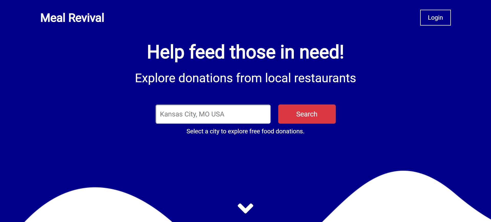
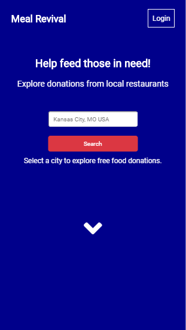
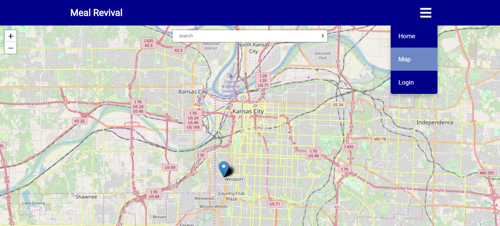
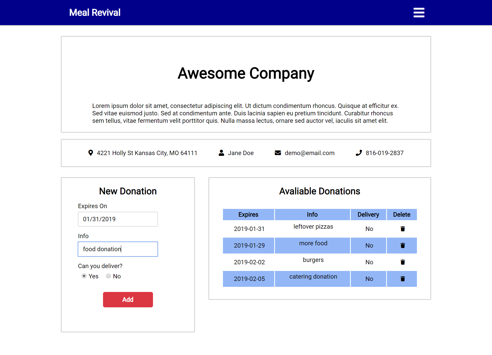

# Meal Revival

Meal Revival is a web app that connects local restaurants to organizations in need of food donations. Restaurants simply list their donations which can then be viewed by others based on thier location. Try it today!

meal-revival-server: https://github.com/rjwilliams87/meal-revival-server

## Getting Started

Check out the app with the below link. Use the dummy credentials to login!

- Credentials  
  email: demo@email.com password: password123

- App  
  https://meal-revival.herokuapp.com/

## Built With

- React
- Redux
- JavaScript
- HTML
- CSS

## Screenshots

### Landing page

Select a city to view donations on the map

### Map

### Profile

Sign up to easily add/remove donations

## Authors

- Ryan J Williams
